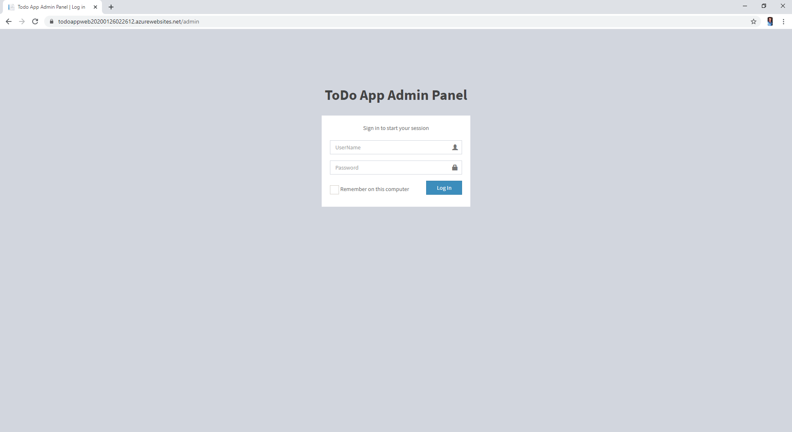
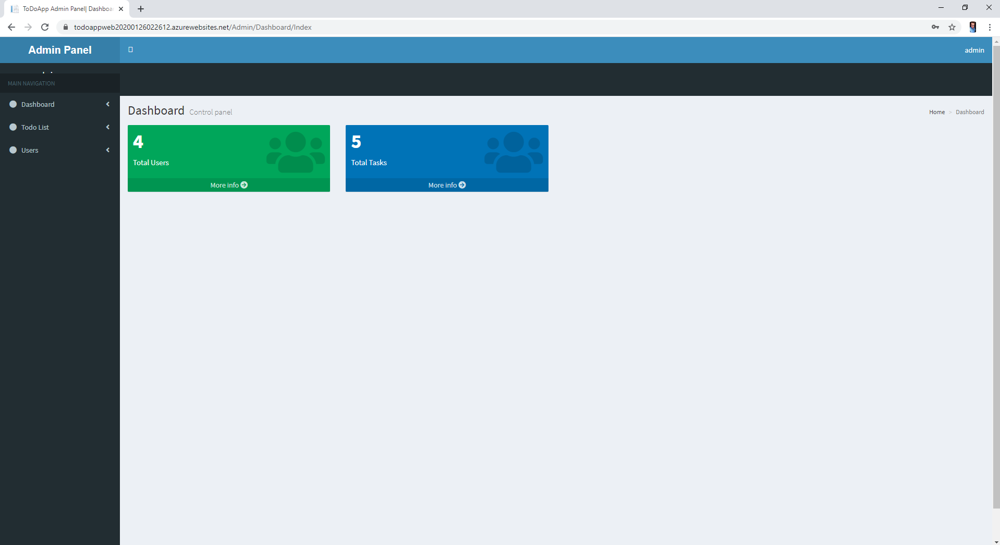
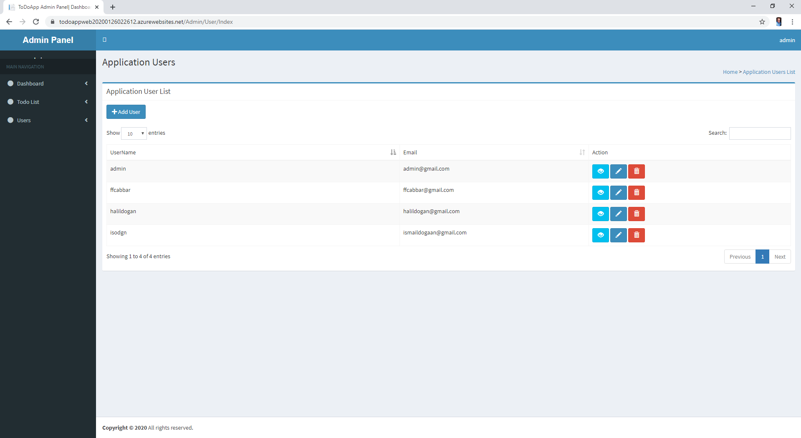
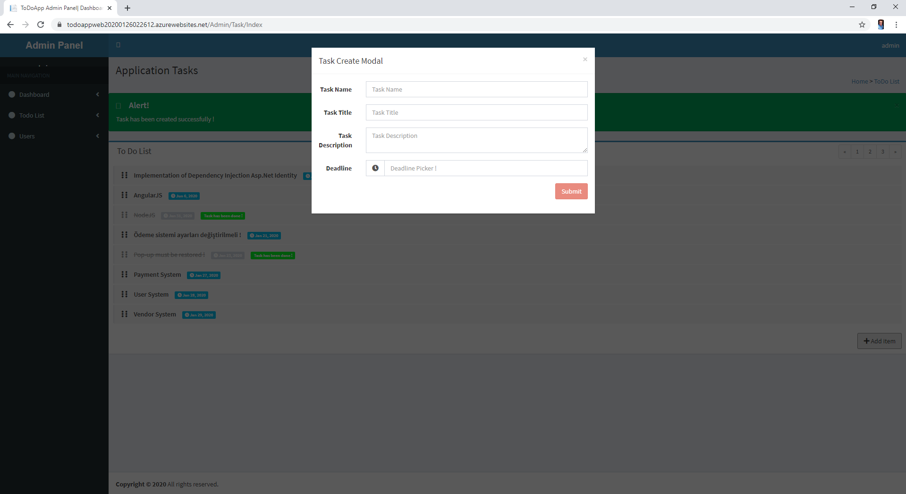
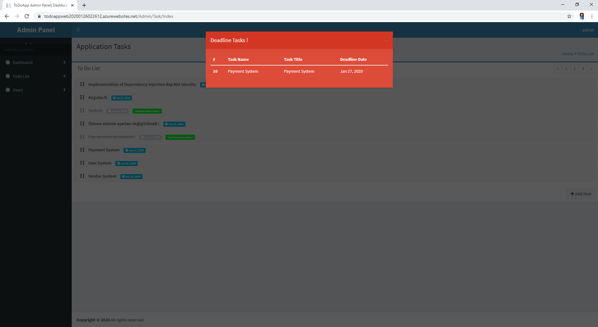
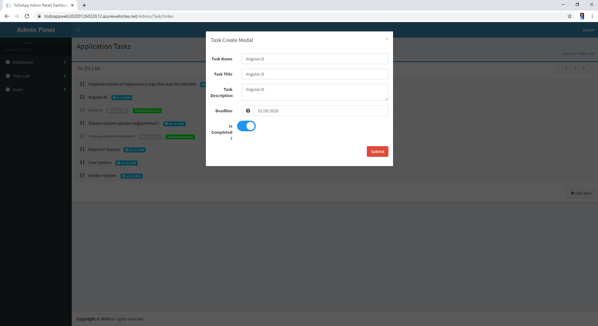
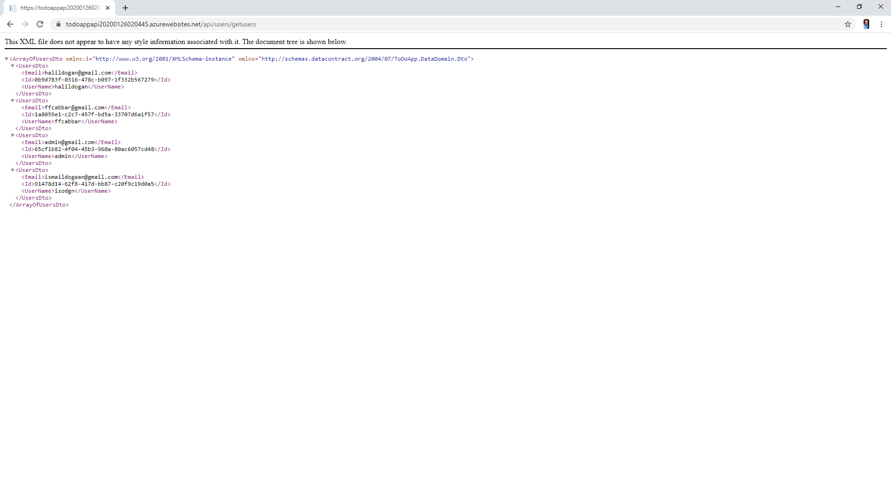
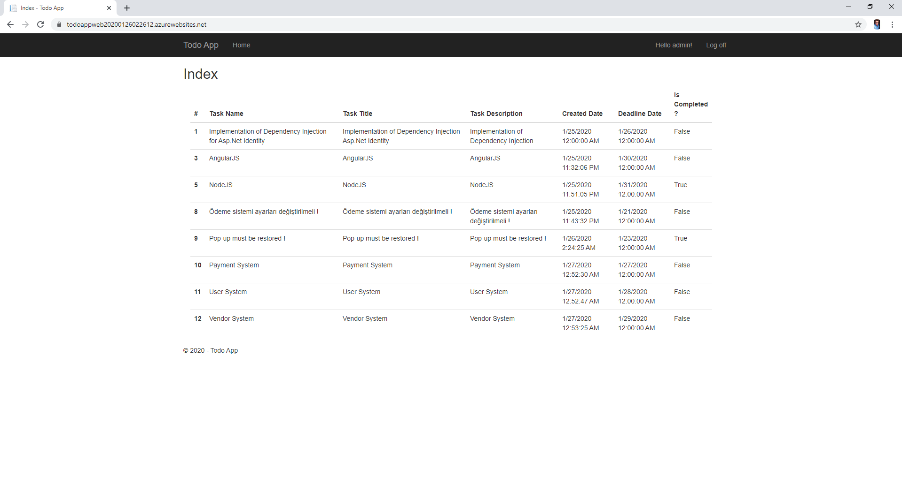

# ToDoApp :bookmark_tabs: :clipboard: :memo:

## Application Admin Informations
******username: admin&nbsp;
******password: 123qwe123qwe

## Application Web Api Link :link:
[Application Web Api Link](https://todoappapi20200126020445.azurewebsites.net/api/users/getusers)

## Application Admin Panel Link :link:
[Application Admin Panel Link](https://todoappweb20200126022612.azurewebsites.net/admin)

## Application PublicUI Link :link:
[Application PublicUI Link](https://todoappweb20200126022612.azurewebsites.net)

# Screenshots :camera:

ToDoApp is a web project that have been developed by using .Net Mvc, AngularJS.
